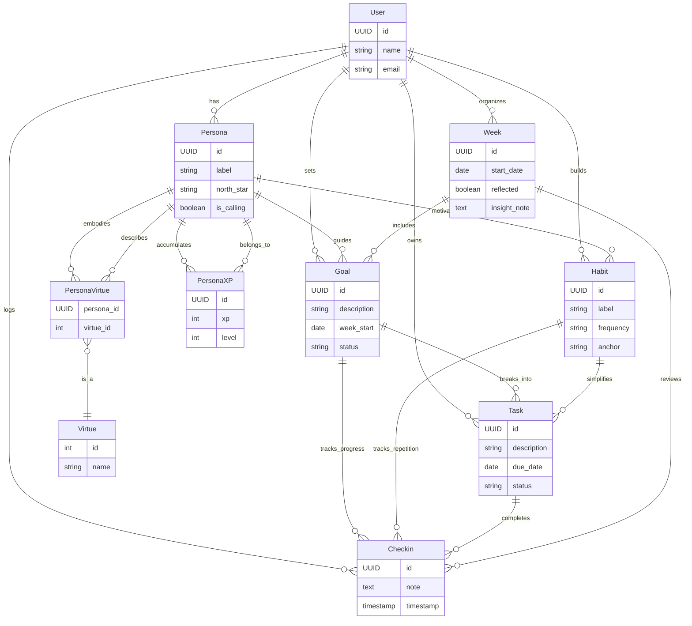

```mermaid
erDiagram
    User ||--o{ Persona : has
    User ||--o{ Goal : sets
    User ||--o{ Habit : builds
    User ||--o{ Task : owns
    User ||--o{ Checkin : logs
    User ||--o{ Week : organizes

    Persona ||--o{ Goal : guides
    Persona ||--o{ Habit : motivates
    Persona ||--o{ PersonaXP : accumulates
    Persona ||--o{ PersonaVirtue : embodies

    Goal ||--o{ Task : breaks_into
    Goal ||--o{ Checkin : tracks_progress

    Habit ||--o{ Task : simplifies
    Habit ||--o{ Checkin : tracks_repetition

    Task ||--o{ Checkin : completes

    PersonaXP }o--|| Persona : belongs_to

    PersonaVirtue }o--|| Persona : describes
    PersonaVirtue }o--|| Virtue : is_a

    Week ||--o{ Goal : includes
    Week ||--o{ Checkin : reviews

    User {
        UUID id
        string name
        string email
    }

    Persona {
        UUID id
        string label
        string north_star
        boolean is_calling
    }

    Goal {
        UUID id
        string description
        date week_start
        string status
    }

    Habit {
        UUID id
        string label
        string frequency
        string anchor
    }

    Task {
        UUID id
        string description
        date due_date
        string status
    }

    Checkin {
        UUID id
        text note
        timestamp timestamp
    }

    Week {
        UUID id
        date start_date
        boolean reflected
        text insight_note
    }

    Virtue {
        int id
        string name
    }

    PersonaXP {
        UUID id
        int xp
        int level
    }

    PersonaVirtue {
        UUID persona_id
        int virtue_id
    }

```
